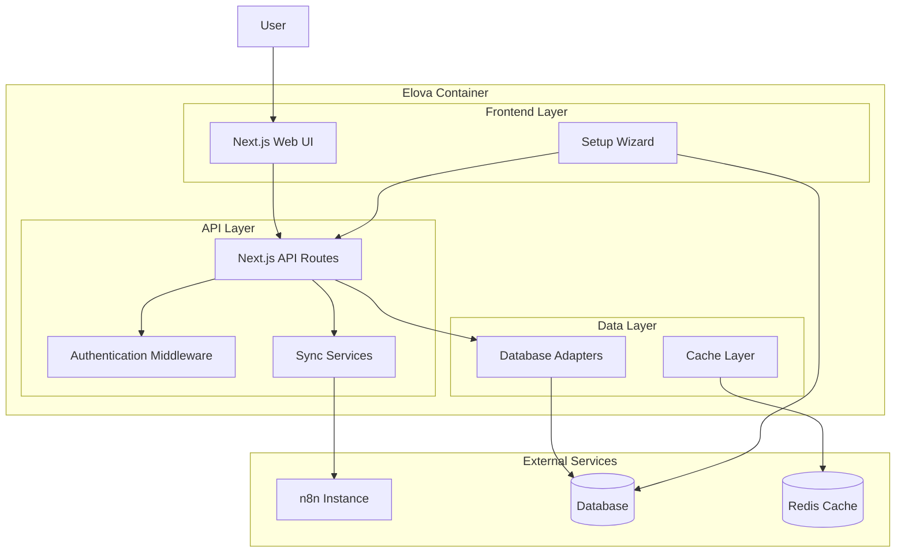
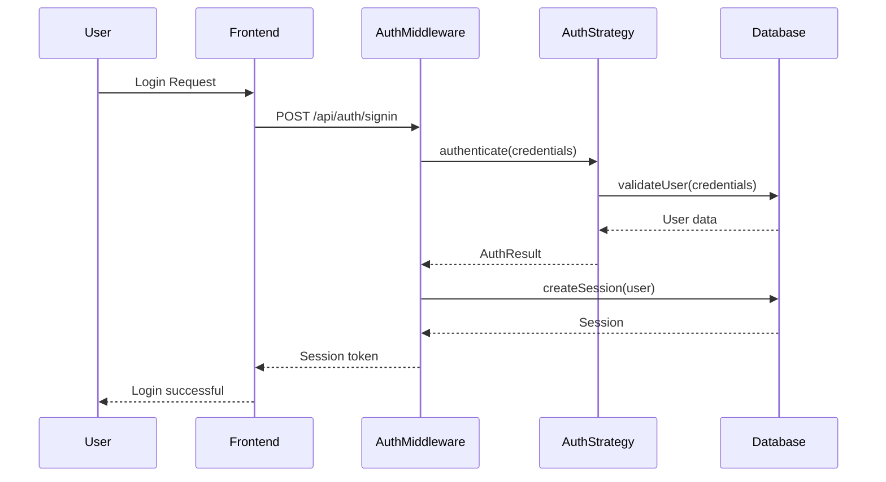
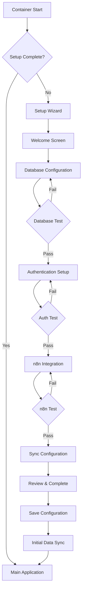
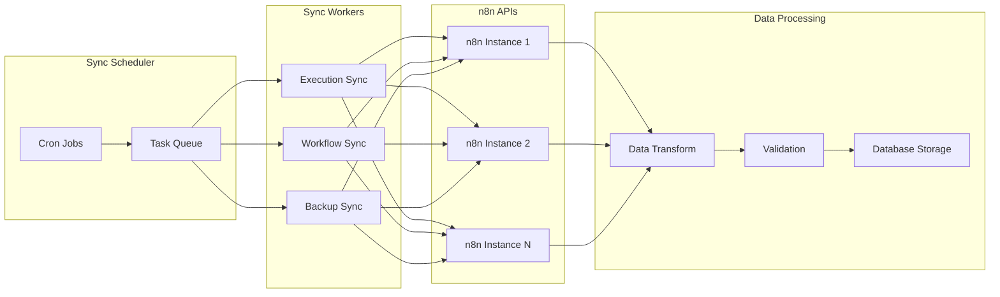

# Elova - Architecture Overview

This document outlines the technical architecture of Elova as a self-hosted, open-source workflow observability solution.

## Table of Contents

- [System Overview](#system-overview)
- [Core Components](#core-components)
- [Database Architecture](#database-architecture)
- [Authentication System](#authentication-system)
- [Setup Workflow](#setup-workflow)
- [Data Flow](#data-flow)
- [Multi-Database Support](#multi-database-support)
- [Deployment Architecture](#deployment-architecture)
- [Security Considerations](#security-considerations)

## System Overview

Elova is designed as a self-contained, containerized application that provides analytics and monitoring for workflow automation instances across multiple platforms (n8n, Zapier, Make.com, etc.). The architecture prioritizes flexibility, ease of deployment, and data retention.



### Key Design Principles

1. **Self-Contained**: Single container deployment with minimal external dependencies
2. **Database Agnostic**: Support for SQLite, PostgreSQL, and MySQL
3. **Authentication Flexible**: Multiple auth strategies (simple, Supabase, SSO)
4. **Setup-Driven**: First-run wizard configures the entire system
5. **Data Retention**: Preserve n8n execution data beyond community limits
6. **Multi-Instance**: Connect to multiple n8n instances from one dashboard

## Core Components

### 1. Frontend Layer

**Next.js 14 with App Router**
- Server-side rendering for optimal performance
- TypeScript for type safety
- Tailwind CSS for responsive design
- React contexts for state management

**Key Pages:**
- Setup Wizard (`/setup`)
- Dashboard (`/dashboard`) 
- Executions (`/executions`)
- Workflows (`/workflows`)
- Analytics (`/analytics`)
- Settings (`/settings`)

### 2. API Layer

**Next.js API Routes**
- RESTful API design
- Middleware-based authentication
- Request validation and error handling
- Rate limiting and security headers

**Key Endpoints:**
- `/api/setup/*` - Setup wizard APIs
- `/api/auth/*` - Authentication endpoints
- `/api/executions` - Execution data
- `/api/workflows` - Workflow management
- `/api/sync/*` - Manual sync triggers
- `/api/health` - Health checks

### 3. Data Sync Services

**Background Sync System**
- Configurable sync intervals
- Error handling and retry logic
- Data transformation and validation
- Multiple n8n instance support

**Sync Types:**
- **Executions**: Every 15 minutes (configurable)
- **Workflows**: Every 6 hours (configurable)  
- **Backups**: Daily (configurable)

### 4. Database Layer

**Multi-Database Adapter Pattern**
- Abstracted database operations
- Support for SQLite, PostgreSQL, MySQL
- Automatic migrations
- Connection pooling and optimization

## Database Architecture

### Schema Design

```sql
-- Core configuration
CREATE TABLE IF NOT EXISTS config (
    key VARCHAR(255) PRIMARY KEY,
    value TEXT,
    encrypted BOOLEAN DEFAULT false,
    created_at TIMESTAMP DEFAULT CURRENT_TIMESTAMP,
    updated_at TIMESTAMP DEFAULT CURRENT_TIMESTAMP
);

-- n8n provider instances
CREATE TABLE IF NOT EXISTS providers (
    id UUID PRIMARY KEY DEFAULT gen_random_uuid(),
    name VARCHAR(255) NOT NULL,
    host VARCHAR(255) NOT NULL,
    api_key_encrypted TEXT NOT NULL,
    is_active BOOLEAN DEFAULT true,
    last_sync_at TIMESTAMP,
    sync_status VARCHAR(50) DEFAULT 'pending',
    created_at TIMESTAMP DEFAULT CURRENT_TIMESTAMP,
    updated_at TIMESTAMP DEFAULT CURRENT_TIMESTAMP
);

-- Workflows from n8n instances
CREATE TABLE IF NOT EXISTS workflows (
    id UUID PRIMARY KEY DEFAULT gen_random_uuid(),
    provider_id UUID REFERENCES providers(id),
    provider_workflow_id VARCHAR(255) NOT NULL,
    name VARCHAR(255) NOT NULL,
    active BOOLEAN DEFAULT true,
    tags JSONB DEFAULT '[]',
    workflow_data JSONB,
    created_at TIMESTAMP DEFAULT CURRENT_TIMESTAMP,
    updated_at TIMESTAMP DEFAULT CURRENT_TIMESTAMP,
    UNIQUE(provider_id, provider_workflow_id)
);

-- Executions from n8n instances  
CREATE TABLE IF NOT EXISTS executions (
    id UUID PRIMARY KEY DEFAULT gen_random_uuid(),
    provider_id UUID REFERENCES providers(id),
    workflow_id UUID REFERENCES workflows(id),
    provider_execution_id VARCHAR(255) NOT NULL,
    status VARCHAR(50) NOT NULL,
    mode VARCHAR(50) NOT NULL,
    started_at TIMESTAMP NOT NULL,
    stopped_at TIMESTAMP,
    duration INTEGER,
    error_data JSONB,
    metadata JSONB,
    created_at TIMESTAMP DEFAULT CURRENT_TIMESTAMP,
    UNIQUE(provider_id, provider_execution_id)
);

-- User management (for multi-user setups)
CREATE TABLE IF NOT EXISTS users (
    id UUID PRIMARY KEY DEFAULT gen_random_uuid(),
    email VARCHAR(255) UNIQUE NOT NULL,
    password_hash VARCHAR(255),
    name VARCHAR(255),
    role VARCHAR(50) DEFAULT 'user',
    is_active BOOLEAN DEFAULT true,
    created_at TIMESTAMP DEFAULT CURRENT_TIMESTAMP,
    updated_at TIMESTAMP DEFAULT CURRENT_TIMESTAMP
);

-- Sync logs for monitoring
CREATE TABLE IF NOT EXISTS sync_logs (
    id UUID PRIMARY KEY DEFAULT gen_random_uuid(),
    provider_id UUID REFERENCES providers(id),
    sync_type VARCHAR(50) NOT NULL,
    status VARCHAR(50) NOT NULL,
    records_processed INTEGER DEFAULT 0,
    error_message TEXT,
    started_at TIMESTAMP NOT NULL,
    completed_at TIMESTAMP,
    duration INTEGER
);

-- Indexes for performance
CREATE INDEX IF NOT EXISTS idx_executions_provider_started ON executions(provider_id, started_at DESC);
CREATE INDEX IF NOT EXISTS idx_executions_workflow_started ON executions(workflow_id, started_at DESC);
CREATE INDEX IF NOT EXISTS idx_executions_status ON executions(status);
CREATE INDEX IF NOT EXISTS idx_workflows_provider ON workflows(provider_id);
CREATE INDEX IF NOT EXISTS idx_workflows_active ON workflows(active);
CREATE INDEX IF NOT EXISTS idx_sync_logs_provider_type ON sync_logs(provider_id, sync_type);
```

### Database Adapters

```typescript
// Abstract database adapter
interface DatabaseAdapter {
  // Connection management
  connect(): Promise<void>
  disconnect(): Promise<void>
  health(): Promise<boolean>
  
  // Setup and migrations
  initialize(): Promise<void>
  migrate(): Promise<void>
  
  // Configuration
  getConfig(key: string): Promise<string | null>
  setConfig(key: string, value: string, encrypted?: boolean): Promise<void>
  
  // Providers
  getProviders(): Promise<Provider[]>
  createProvider(provider: Omit<Provider, 'id'>): Promise<Provider>
  updateProvider(id: string, updates: Partial<Provider>): Promise<Provider>
  
  // Workflows  
  getWorkflows(providerId?: string): Promise<Workflow[]>
  upsertWorkflow(workflow: Workflow): Promise<Workflow>
  
  // Executions
  getExecutions(filters: ExecutionFilters): Promise<PaginatedResult<Execution>>
  upsertExecution(execution: Execution): Promise<Execution>
  
  // Analytics
  getExecutionStats(filters: StatsFilters): Promise<ExecutionStats>
  getWorkflowStats(filters: StatsFilters): Promise<WorkflowStats>
}

// Database-specific implementations
class SQLiteAdapter implements DatabaseAdapter { /* ... */ }
class PostgreSQLAdapter implements DatabaseAdapter { /* ... */ }
class MySQLAdapter implements DatabaseAdapter { /* ... */ }
```

## Authentication System

### Multi-Strategy Authentication

```typescript
interface AuthStrategy {
  name: string
  initialize(config: AuthConfig): Promise<void>
  authenticate(request: Request): Promise<AuthResult>
  createSession(user: User): Promise<Session>
  validateSession(sessionId: string): Promise<User | null>
  signOut(sessionId: string): Promise<void>
}

// Authentication strategies
class SimpleAuthStrategy implements AuthStrategy {
  // Username/password with local user management
  // Session storage in database
  // Password hashing with bcrypt
}

class SupabaseAuthStrategy implements AuthStrategy {
  // Supabase authentication integration
  // JWT token validation
  // User profile synchronization
}

class OIDCAuthStrategy implements AuthStrategy {
  // OpenID Connect integration
  // SSO provider support
  // Claims mapping
}
```

### Authentication Flow



## Setup Workflow

### First-Run Setup Wizard

The setup wizard runs on the first application startup and configures the entire system:



### Setup Wizard API Design

```typescript
// Setup wizard endpoints
interface SetupAPI {
  // GET /api/setup/status - Check setup completion
  getSetupStatus(): Promise<SetupStatus>
  
  // POST /api/setup/database - Configure database
  configureDatabase(config: DatabaseConfig): Promise<TestResult>
  
  // POST /api/setup/auth - Configure authentication
  configureAuth(config: AuthConfig): Promise<TestResult>
  
  // POST /api/setup/n8n - Configure n8n integration
  configureN8n(config: N8nConfig): Promise<TestResult>
  
  // POST /api/setup/sync - Configure sync settings
  configureSync(config: SyncConfig): Promise<TestResult>
  
  // POST /api/setup/complete - Finalize setup
  completeSetup(): Promise<CompletionResult>
}
```

## Data Flow

### Sync Service Architecture



### Data Processing Pipeline

```typescript
interface DataProcessor<T> {
  extract(provider: Provider): Promise<T[]>
  transform(data: T[]): Promise<InternalFormat[]>
  validate(data: InternalFormat[]): Promise<ValidationResult>
  load(data: InternalFormat[]): Promise<StorageResult>
}

class ExecutionProcessor implements DataProcessor<N8nExecution> {
  async extract(provider: Provider): Promise<N8nExecution[]> {
    const n8nClient = new N8nApiClient(provider)
    return await n8nClient.getExecutions({
      limit: this.batchSize,
      lastId: provider.lastSyncCursor
    })
  }
  
  async transform(executions: N8nExecution[]): Promise<Execution[]> {
    return executions.map(exec => ({
      id: generateUUID(),
      providerId: this.provider.id,
      providerExecutionId: exec.id,
      workflowId: this.getWorkflowId(exec.workflowId),
      status: this.mapStatus(exec.status),
      mode: this.mapMode(exec.mode),
      startedAt: new Date(exec.startedAt),
      stoppedAt: exec.stoppedAt ? new Date(exec.stoppedAt) : null,
      duration: this.calculateDuration(exec),
      errorData: exec.error ? { message: exec.error } : null,
      metadata: {
        workflowName: exec.workflowName,
        retryOf: exec.retryOf,
        finished: exec.finished
      }
    }))
  }
  
  async validate(executions: Execution[]): Promise<ValidationResult> {
    // Validate data integrity, required fields, etc.
  }
  
  async load(executions: Execution[]): Promise<StorageResult> {
    // Batch upsert to database
  }
}
```

## Multi-Database Support

### Database Factory Pattern

```typescript
class DatabaseFactory {
  static create(config: DatabaseConfig): DatabaseAdapter {
    switch (config.type) {
      case 'sqlite':
        return new SQLiteAdapter(config.url)
      case 'postgresql':
        return new PostgreSQLAdapter(config.url)
      case 'mysql':
        return new MySQLAdapter(config.url)
      default:
        throw new Error(`Unsupported database type: ${config.type}`)
    }
  }
}

// Configuration-driven database selection
const databaseAdapter = DatabaseFactory.create({
  type: process.env.DATABASE_TYPE || 'sqlite',
  url: process.env.DATABASE_URL || 'file:./data/database.sqlite'
})
```

### Migration System

```typescript
interface Migration {
  version: string
  name: string
  up(adapter: DatabaseAdapter): Promise<void>
  down(adapter: DatabaseAdapter): Promise<void>
}

class MigrationRunner {
  constructor(private adapter: DatabaseAdapter) {}
  
  async runMigrations(): Promise<void> {
    const currentVersion = await this.getCurrentVersion()
    const migrations = await this.getPendingMigrations(currentVersion)
    
    for (const migration of migrations) {
      console.log(`Running migration: ${migration.name}`)
      await migration.up(this.adapter)
      await this.updateVersion(migration.version)
    }
  }
}
```

## Deployment Architecture

### Container Design

```dockerfile
# Multi-stage Docker build
FROM node:18-alpine AS builder
WORKDIR /app
COPY package*.json ./
RUN npm ci --only=production

FROM node:18-alpine AS runtime
WORKDIR /app

# Create non-root user
RUN addgroup -g 1001 -S nodejs
RUN adduser -S nextjs -u 1001

# Copy application
COPY --from=builder /app/node_modules ./node_modules
COPY . .
RUN chown -R nextjs:nodejs /app

# Expose port and set user
EXPOSE 3000
USER nextjs

# Health check
HEALTHCHECK --interval=30s --timeout=10s --start-period=60s \
  CMD curl -f http://localhost:3000/api/health || exit 1

CMD ["npm", "start"]
```

### Configuration Management

```typescript
interface AppConfig {
  // Application settings
  nodeEnv: string
  port: number
  logLevel: string
  
  // Database configuration
  database: {
    type: 'sqlite' | 'postgresql' | 'mysql'
    url: string
    poolSize?: number
    timeout?: number
  }
  
  // Authentication configuration
  auth: {
    type: 'simple' | 'supabase' | 'oidc'
    secret: string
    sessionTimeout?: number
    // Type-specific config
    supabase?: SupabaseConfig
    oidc?: OIDCConfig
  }
  
  // n8n integration
  n8n: {
    host: string
    apiKey: string
    timeout?: number
    retries?: number
  }
  
  // Sync configuration
  sync: {
    frequencies: {
      executions: string // '15m'
      workflows: string  // '6h'
      backups: string    // '24h'
    }
    batchSizes: {
      executions: number // 200
      workflows: number  // 50
      backups: number    // 20
    }
    retention: {
      days: number // 90
    }
  }
  
  // Security settings
  security: {
    corsOrigin?: string
    csrfProtection: boolean
    httpsRedirect: boolean
    rateLimiting: {
      requests: number  // 100
      window: string    // '15m'
    }
  }
}

class ConfigManager {
  private static instance: AppConfig
  
  static load(): AppConfig {
    return {
      nodeEnv: process.env.NODE_ENV || 'development',
      port: parseInt(process.env.PORT || '3000'),
      logLevel: process.env.LOG_LEVEL || 'info',
      
      database: {
        type: (process.env.DATABASE_TYPE as any) || 'sqlite',
        url: process.env.DATABASE_URL || 'file:./data/database.sqlite',
        poolSize: parseInt(process.env.DATABASE_POOL_SIZE || '10'),
        timeout: parseInt(process.env.DATABASE_TIMEOUT || '30000')
      },
      
      auth: {
        type: (process.env.AUTH_TYPE as any) || 'simple',
        secret: process.env.AUTH_SECRET || 'change-me-in-production',
        sessionTimeout: process.env.SESSION_TIMEOUT || '24h'
      },
      
      n8n: {
        host: process.env.N8N_HOST || '',
        apiKey: process.env.N8N_API_KEY || '',
        timeout: parseInt(process.env.N8N_TIMEOUT || '30000'),
        retries: parseInt(process.env.N8N_RETRIES || '3')
      },
      
      sync: {
        frequencies: {
          executions: process.env.SYNC_FREQUENCY_EXECUTIONS || '15m',
          workflows: process.env.SYNC_FREQUENCY_WORKFLOWS || '6h',
          backups: process.env.SYNC_FREQUENCY_BACKUPS || '24h'
        },
        batchSizes: {
          executions: parseInt(process.env.SYNC_BATCH_EXECUTIONS || '200'),
          workflows: parseInt(process.env.SYNC_BATCH_WORKFLOWS || '50'),
          backups: parseInt(process.env.SYNC_BATCH_BACKUPS || '20')
        },
        retention: {
          days: parseInt(process.env.DATA_RETENTION_DAYS || '90')
        }
      },
      
      security: {
        corsOrigin: process.env.CORS_ORIGIN,
        csrfProtection: process.env.CSRF_PROTECTION === 'true',
        httpsRedirect: process.env.HTTPS_REDIRECT === 'true',
        rateLimiting: {
          requests: parseInt(process.env.RATE_LIMIT_REQUESTS || '100'),
          window: process.env.RATE_LIMIT_WINDOW || '15m'
        }
      }
    }
  }
}
```

## Security Considerations

### Data Protection

1. **Encryption at Rest**
   - Sensitive configuration encrypted with AES-256
   - API keys encrypted before database storage
   - Optional database-level encryption

2. **Encryption in Transit**
   - HTTPS/TLS for all communications
   - Certificate management and renewal
   - Secure headers and HSTS

3. **Authentication Security**
   - Password hashing with bcrypt (cost factor 12)
   - Session tokens with secure random generation
   - CSRF protection for web forms
   - Rate limiting on authentication endpoints

### Network Security

```typescript
// Security middleware stack
const securityMiddleware = [
  // HTTPS redirect
  httpsRedirect(),
  
  // Security headers
  helmet({
    contentSecurityPolicy: {
      directives: {
        defaultSrc: ["'self'"],
        styleSrc: ["'self'", "'unsafe-inline'"],
        scriptSrc: ["'self'"],
        imgSrc: ["'self'", "data:", "https:"]
      }
    }
  }),
  
  // CORS configuration
  cors({
    origin: config.security.corsOrigin || false,
    credentials: true
  }),
  
  // Rate limiting
  rateLimit({
    windowMs: parseTimeString(config.security.rateLimiting.window),
    max: config.security.rateLimiting.requests,
    standardHeaders: true,
    legacyHeaders: false
  }),
  
  // Request size limits
  express.json({ limit: '10mb' }),
  express.urlencoded({ extended: true, limit: '10mb' })
]
```

### Access Control

```typescript
// Role-based access control
enum Role {
  ADMIN = 'admin',
  USER = 'user',
  VIEWER = 'viewer'
}

interface Permission {
  resource: string
  action: string
  conditions?: Record<string, any>
}

class AccessControl {
  private permissions: Map<Role, Permission[]> = new Map([
    [Role.ADMIN, [
      { resource: '*', action: '*' }
    ]],
    [Role.USER, [
      { resource: 'executions', action: 'read' },
      { resource: 'workflows', action: 'read' },
      { resource: 'sync', action: 'trigger' },
      { resource: 'dashboard', action: 'read' }
    ]],
    [Role.VIEWER, [
      { resource: 'executions', action: 'read' },
      { resource: 'workflows', action: 'read' },
      { resource: 'dashboard', action: 'read' }
    ]]
  ])
  
  hasPermission(user: User, resource: string, action: string): boolean {
    const userPermissions = this.permissions.get(user.role) || []
    return userPermissions.some(perm => 
      (perm.resource === '*' || perm.resource === resource) &&
      (perm.action === '*' || perm.action === action)
    )
  }
}
```

This architecture provides a solid foundation for the self-hosted Elova application, with flexibility for different deployment scenarios, database backends, and authentication strategies while maintaining security and performance.
