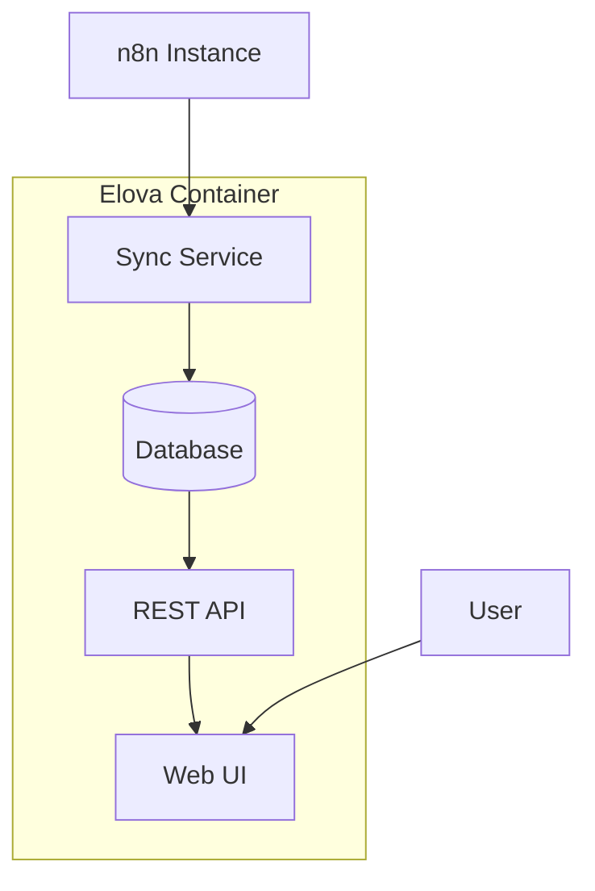

# Elova - Workflow Observability Platform

**Monitor and analyze your n8n workflows** with beautiful dashboards and real-time insights.

[](./QUICK_START.md)
[](./LICENSE)
[](https://n8n.io)

## 🚀 Quick Start (3 Steps)

**Get Elova running in under 5 minutes:**

### 1. Create `docker-compose.yml`

**Option A: Download the simple template**
```bash
curl -o docker-compose.yml https://raw.githubusercontent.com/philipphaunstetter/n8n-analytics/main/docker-compose.simple.yml
```

**Option B: If you cloned the repo**
```bash
cp docker-compose.simple.yml docker-compose.yml
```

**Option C: Create it manually**

```yaml
version: '3.8'
services:
  elova:
    image: ghcr.io/philipphaunstetter/n8n-analytics:latest
    container_name: elova
    restart: always
    ports:
      # Change the first port to use a different host port
      # Examples: "8080:3000", "3001:3000", "5000:3000"  
      - "3000:3000"
    environment:
      - NODE_ENV=production
      - PORT=3000
      - GENERIC_TIMEZONE=UTC
      - TZ=UTC
    volumes:
      - elova_data:/home/node/.elova

volumes:
  elova_data:
```

### 2. Start Elova

```bash
docker compose up -d
```

#### 🎯 **Version Channels**

**Stable (Recommended)**
- **Image**: `ghcr.io/philipphaunstetter/n8n-analytics:latest`
- **Use for**: Production deployments
- **Updates**: Stable releases only

**Pre-release (Testing)**
- **Image**: `ghcr.io/philipphaunstetter/n8n-analytics:beta`
- **Use for**: Testing new features, development
- **Updates**: Beta releases with latest features

```yaml
# For beta/testing (in docker-compose.yml)
services:
  elova:
    image: ghcr.io/philipphaunstetter/n8n-analytics:beta
```

### 3. Complete Setup

Open http://localhost:3000 and complete the initial setup:

- **n8n Connection**: Enter your n8n URL and API key
- **Timezone**: Set your timezone for accurate scheduling  
- **Features**: Enable demo mode or other options

All configuration is stored securely in the SQLite database - no `.env` file needed!

**That's it!** Access Elova at **http://localhost:3000** (or your configured port)

### 🔌 **Port Configuration**

To use a different port, edit the `ports` section in your `docker-compose.yml`:

```yaml
ports:
  - "8080:3000"  # Access via http://localhost:8080
```

Common alternatives:
- **Port 8080**: `"8080:3000"` → http://localhost:8080
- **Port 3001**: `"3001:3000"` → http://localhost:3001  
- **Port 5000**: `"5000:3000"` → http://localhost:5000

> 💡 **Pro tip**: Enable demo mode during setup to explore with sample data!

## 🎯 Features

- **📊 Real-time Dashboard**: Live workflow monitoring and metrics
- **📈 Performance Analytics**: Execution times, success rates, trends  
- **🔍 Error Tracking**: Detailed error analysis and troubleshooting
- **⏰ Historical Data**: Long-term workflow performance insights
- **🚨 Smart Alerts**: Configurable notifications for issues
- **🔄 Multi-instance**: Monitor multiple n8n deployments
- **📱 Responsive UI**: Works great on mobile and desktop

## 📋 Prerequisites

- **Docker** installed ([Get Docker](https://docs.docker.com/get-docker/))
- **n8n instance** with API access
- **5 minutes** of your time

## 🔧 Getting Your n8n API Key

1. Open your n8n instance
2. Go to **Settings** > **n8n API**
3. Create a new API key
4. Copy the key to your `.env` file

## 📚 Documentation

- **[Quick Start Guide](./QUICK_START.md)** - Get up and running in 5 minutes
- **[Docker Installation](./DOCKER_INSTALLATION.md)** - Comprehensive Docker setup guide
- **[Contributing](./CONTRIBUTING.md)** - How to contribute to the project

## 🛠️ Management

```bash
# Check status
docker compose ps

# View logs
docker compose logs -f elova

# Update to latest version
docker compose pull && docker compose up -d

# Stop Elova
docker compose down
```

## 🆘 Common Issues

**Port 3000 already in use?**
```yaml
# Change port in docker-compose.yml
ports:
  - "3001:3000"  # Use port 3001 instead
```

**n8n connection issues?**
- Verify your `N8N_HOST` is accessible
- Check your `N8N_API_KEY` is valid
- Ensure n8n API is enabled

## 🤝 Contributing

We welcome contributions! Please see [CONTRIBUTING.md](./CONTRIBUTING.md) for guidelines.

## 📄 License

MIT License - see [LICENSE](./LICENSE) for details.

---

**Made with ❤️ for the n8n community**

### Docker Deployment (Recommended)

#### Option 1: Pre-built Images (Fastest)

```bash
# Pull the latest image
docker pull ghcr.io/your-username/elova:latest

# Run with minimal configuration
docker run -d \
  --name elova \
  -p 3000:3000 \
  -e AUTH_SECRET=your-secure-secret-minimum-32-chars \
  ghcr.io/your-username/elova:latest
```

#### Option 2: Docker Compose (Full Stack)

```bash
# Download and run production stack
curl -O https://raw.githubusercontent.com/your-username/elova/main/docker-compose.production.yml
curl -O https://raw.githubusercontent.com/your-username/elova/main/.env.production.template
cp .env.production.template .env.production
# Edit .env.production with your settings
docker-compose -f docker-compose.production.yml up -d
```

**Available Docker Tags:**
- `latest` - Latest stable release
- `v1.0.0` - Specific version releases  
- `main` - Latest development build

**First-time setup:**
1. Open http://localhost:3000
2. Complete the setup wizard
3. Configure your n8n connection
4. Choose your database and auth method

### Docker Compose

```yaml
version: '3.8'
services:
  elova:
    image: elova:latest
    ports:
      - "3000:3000"
    volumes:
      - ./data:/app/data
      - ./config:/app/config
    environment:
      - NODE_ENV=production
    restart: unless-stopped
```

### Manual Installation

```bash
git clone https://github.com/your-org/elova.git
cd elova
npm install
npm run build
npm start
```

## 📋 Requirements

- **n8n Instance**: Community or Pro edition with API access
- **Docker**: For containerized deployment (recommended)
- **Database**: SQLite (default), PostgreSQL, or MySQL
- **Resources**: 512MB RAM, 1GB storage minimum

## 🔧 Configuration

### Setup Wizard

On first startup, the setup wizard will guide you through:

1. **Database Configuration**
   - SQLite (file-based, no setup required)
   - PostgreSQL (for production workloads)
   - MySQL (alternative production option)

2. **Authentication Setup**
   - Simple username/password
   - Supabase integration
   - SSO providers (OIDC, SAML)

3. **n8n Connection**
   - Instance URL and API key
   - Sync frequency settings
   - Data retention policies

### Manual Configuration

Environment variables for advanced setups:

```env
# Database
DATABASE_TYPE=sqlite|postgresql|mysql
DATABASE_URL=your-database-connection-string

# Authentication
AUTH_TYPE=simple|supabase|oidc
AUTH_SECRET=your-auth-secret

# n8n Connection
N8N_HOST=https://your-n8n-instance.com
N8N_API_KEY=your-n8n-api-key

# Sync Settings
SYNC_FREQUENCY_EXECUTIONS=15m
SYNC_FREQUENCY_WORKFLOWS=6h
SYNC_FREQUENCY_BACKUPS=24h
```

## 📖 Documentation

- **[Setup Guide](./SETUP.md)** - Detailed installation and configuration
- **[Deployment Guide](./DEPLOYMENT.md)** - Docker, Kubernetes, and production deployments
- **[API Reference](./API.md)** - REST API documentation
- **[Contributing](./CONTRIBUTING.md)** - How to contribute to the project

## 🏗️ Architecture



**Tech Stack:**
- **Frontend**: Next.js 14, TypeScript, Tailwind CSS
- **Backend**: Node.js, Next.js API Routes
- **Database**: SQLite (default), PostgreSQL, MySQL
- **Container**: Docker with multi-stage builds
- **Authentication**: Flexible auth layer with multiple providers

## 🚢 Deployment Options

### Production Deployments

- **[Docker Compose](./DEPLOYMENT.md#docker-compose)** - Single-node deployment
- **[Kubernetes](./DEPLOYMENT.md#kubernetes)** - Scalable container orchestration
- **[Manual](./DEPLOYMENT.md#manual-deployment)** - Traditional server deployment

### Cloud Platforms

- **Railway**: One-click deployment
- **DigitalOcean Apps**: Container deployment
- **AWS ECS/Fargate**: Enterprise container hosting
- **Self-hosted**: Your own infrastructure

## 🤝 Contributing

We welcome contributions from the community!

```bash
# Development setup
git clone https://github.com/your-org/elova.git
cd elova
npm install
npm run dev
```

- **Bug Reports**: [Open an issue](https://github.com/your-org/elova/issues)
- **Feature Requests**: [Start a discussion](https://github.com/your-org/elova/discussions)
- **Pull Requests**: See [Contributing Guide](./CONTRIBUTING.md)

## 📝 License

MIT License - see [LICENSE](./LICENSE) file for details.

## 🙏 Acknowledgments

- [n8n.io](https://n8n.io) - The amazing workflow automation platform
- [Next.js](https://nextjs.org) - React framework for production
- [Tailwind CSS](https://tailwindcss.com) - Utility-first CSS framework

---

**⭐ Star us on GitHub if this project helps you!**
