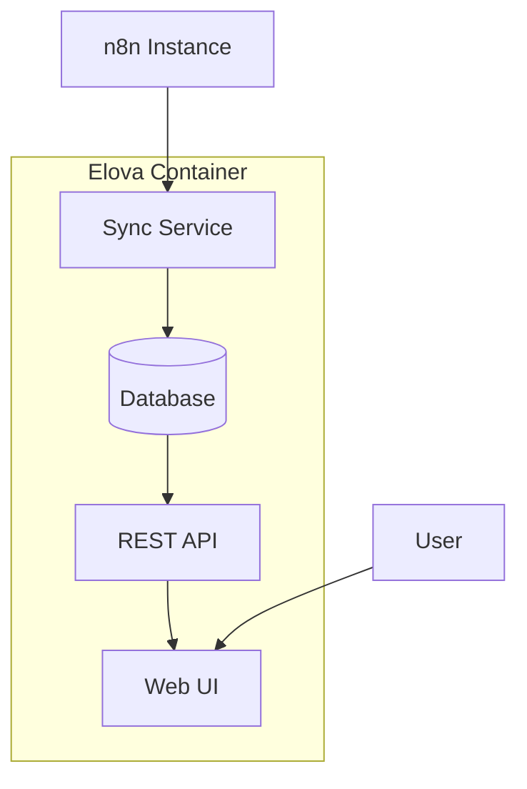

# Elova - Open Source Workflow Observability Platform

🚀 **Self-hosted analytics and monitoring solution for workflow automation platforms**

Gain deep insights into your automation workflows with comprehensive execution monitoring, performance analytics, and unified observability across n8n, Zapier, Make.com and more.

[](./DEPLOYMENT.md)
[](./LICENSE)
[](https://n8n.io)

## ✨ Features

### 📊 **Analytics & Monitoring**
- Real-time execution monitoring and alerts
- Performance analytics with detailed metrics
- Success rates, error patterns, and execution trends
- Interactive dashboards with filtering and search

### 🔄 **Data Management** 
- **Data Retention**: Preserve execution history beyond n8n's limitations
- **Multi-instance Support**: Connect multiple n8n instances
- **Automated Sync**: Background synchronization with configurable intervals
- **Workflow Backups**: Automatic workflow definition backups

### 🛠️ **Self-Hosted & Flexible**
- **Docker-ready**: One-command deployment
- **Database Choice**: SQLite, PostgreSQL, or MySQL support
- **Authentication Options**: Supabase, SSO, or simple auth
- **Setup Wizard**: Guided configuration on first run

## 🚀 Quick Start

### Docker Deployment (Recommended)

#### Option 1: Pre-built Images (Fastest)

```bash
# Pull the latest image
docker pull ghcr.io/your-username/elova:latest

# Run with minimal configuration
docker run -d \
  --name elova \
  -p 3000:3000 \
  -e AUTH_SECRET=your-secure-secret-minimum-32-chars \
  ghcr.io/your-username/elova:latest
```

#### Option 2: Docker Compose (Full Stack)

```bash
# Download and run production stack
curl -O https://raw.githubusercontent.com/your-username/elova/main/docker-compose.production.yml
curl -O https://raw.githubusercontent.com/your-username/elova/main/.env.production.template
cp .env.production.template .env.production
# Edit .env.production with your settings
docker-compose -f docker-compose.production.yml up -d
```

**Available Docker Tags:**
- `latest` - Latest stable release
- `v1.0.0` - Specific version releases  
- `main` - Latest development build

**First-time setup:**
1. Open http://localhost:3000
2. Complete the setup wizard
3. Configure your n8n connection
4. Choose your database and auth method

### Docker Compose

```yaml
version: '3.8'
services:
  elova:
    image: elova:latest
    ports:
      - "3000:3000"
    volumes:
      - ./data:/app/data
      - ./config:/app/config
    environment:
      - NODE_ENV=production
    restart: unless-stopped
```

### Manual Installation

```bash
git clone https://github.com/your-org/elova.git
cd elova
npm install
npm run build
npm start
```

## 📋 Requirements

- **n8n Instance**: Community or Pro edition with API access
- **Docker**: For containerized deployment (recommended)
- **Database**: SQLite (default), PostgreSQL, or MySQL
- **Resources**: 512MB RAM, 1GB storage minimum

## 🔧 Configuration

### Setup Wizard

On first startup, the setup wizard will guide you through:

1. **Database Configuration**
   - SQLite (file-based, no setup required)
   - PostgreSQL (for production workloads)
   - MySQL (alternative production option)

2. **Authentication Setup**
   - Simple username/password
   - Supabase integration
   - SSO providers (OIDC, SAML)

3. **n8n Connection**
   - Instance URL and API key
   - Sync frequency settings
   - Data retention policies

### Manual Configuration

Environment variables for advanced setups:

```env
# Database
DATABASE_TYPE=sqlite|postgresql|mysql
DATABASE_URL=your-database-connection-string

# Authentication
AUTH_TYPE=simple|supabase|oidc
AUTH_SECRET=your-auth-secret

# n8n Connection
N8N_HOST=https://your-n8n-instance.com
N8N_API_KEY=your-n8n-api-key

# Sync Settings
SYNC_FREQUENCY_EXECUTIONS=15m
SYNC_FREQUENCY_WORKFLOWS=6h
SYNC_FREQUENCY_BACKUPS=24h
```

## 📖 Documentation

- **[Setup Guide](./SETUP.md)** - Detailed installation and configuration
- **[Deployment Guide](./DEPLOYMENT.md)** - Docker, Kubernetes, and production deployments
- **[API Reference](./API.md)** - REST API documentation
- **[Contributing](./CONTRIBUTING.md)** - How to contribute to the project

## 🏗️ Architecture



**Tech Stack:**
- **Frontend**: Next.js 14, TypeScript, Tailwind CSS
- **Backend**: Node.js, Next.js API Routes
- **Database**: SQLite (default), PostgreSQL, MySQL
- **Container**: Docker with multi-stage builds
- **Authentication**: Flexible auth layer with multiple providers

## 🚢 Deployment Options

### Production Deployments

- **[Docker Compose](./DEPLOYMENT.md#docker-compose)** - Single-node deployment
- **[Kubernetes](./DEPLOYMENT.md#kubernetes)** - Scalable container orchestration
- **[Manual](./DEPLOYMENT.md#manual-deployment)** - Traditional server deployment

### Cloud Platforms

- **Railway**: One-click deployment
- **DigitalOcean Apps**: Container deployment
- **AWS ECS/Fargate**: Enterprise container hosting
- **Self-hosted**: Your own infrastructure

## 🤝 Contributing

We welcome contributions from the community!

```bash
# Development setup
git clone https://github.com/your-org/elova.git
cd elova
npm install
npm run dev
```

- **Bug Reports**: [Open an issue](https://github.com/your-org/elova/issues)
- **Feature Requests**: [Start a discussion](https://github.com/your-org/elova/discussions)
- **Pull Requests**: See [Contributing Guide](./CONTRIBUTING.md)

## 📝 License

MIT License - see [LICENSE](./LICENSE) file for details.

## 🙏 Acknowledgments

- [n8n.io](https://n8n.io) - The amazing workflow automation platform
- [Next.js](https://nextjs.org) - React framework for production
- [Tailwind CSS](https://tailwindcss.com) - Utility-first CSS framework

---

**⭐ Star us on GitHub if this project helps you!**
