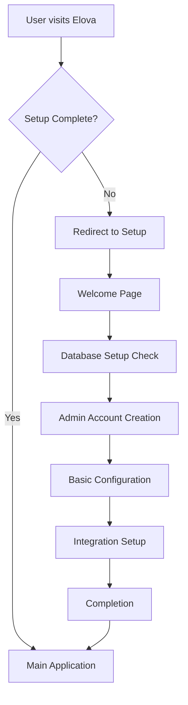

# Elova Setup Workflow

This document describes the comprehensive setup workflow implemented for Elova, providing users with a guided onboarding experience.

## Overview

The setup workflow ensures that new Elova installations are properly configured before users can access the main application. It combines database-based configuration management with a user-friendly web interface.

## Architecture

### Components

1. **Setup Checker Service** (`src/lib/setup/setup-checker.ts`)
   - Determines setup completion status
   - Tracks progress across multiple setup steps
   - Validates requirements for each step

2. **Setup Middleware** (`src/middleware.ts`)
   - Automatically redirects users based on setup status
   - Protects admin routes until setup is complete
   - Handles routing between setup steps

3. **Setup Wizard Pages** (`src/app/setup/`)
   - Multi-step guided setup process
   - Progress tracking and validation
   - User-friendly interface with clear instructions

4. **Configuration System** (Database-based)
   - Secure storage of configuration values
   - Encryption for sensitive data
   - Audit trail for all changes

## Setup Flow

### Steps

1. **Welcome** (`/setup/welcome`)
   - Shows setup progress and requirements
   - Validates system readiness
   - Provides overview of what will be configured

2. **Admin Account** (`/setup/admin`)
   - Creates the initial administrator account
   - Sets up authentication preferences
   - *(Currently simplified - marks admin as created)*

3. **Database Configuration** (`/setup/database`)
   - Confirms database setup (SQLite/Supabase)
   - Applies initial database migrations
   - *(Auto-detected from container initialization)*

4. **Integrations** (`/setup/integrations`)
   - Optional n8n API key configuration
   - Other platform integrations
   - Can be skipped and configured later

5. **Completion** (`/setup/complete`)
   - Finalizes setup process
   - Marks setup as complete in database
   - Redirects to main dashboard

## Configuration Management

The setup process leverages the database-based configuration system:

### Setup Status Tracking

- `app.setup_completed`: Boolean flag indicating completion
- `app.setup_completed_at`: Timestamp of completion
- `setup.admin_account_created`: Admin account status
- `setup.integrations_skipped`: Whether integrations were skipped

### Database Detection

The system automatically detects the database type based on:
- Container initialization script results
- Environment variable presence
- Runtime configuration files

### Security

- Sensitive configuration values are encrypted
- Setup completion requires all critical steps
- Admin routes are protected until setup is complete

## API Endpoints

- `GET /api/setup/status` - Check setup completion status
- `POST /api/setup/complete` - Finalize setup process

## First Run Detection

The system detects first runs through:

1. **Container Marker**: `/app/data/.initialized` file
2. **Database State**: Configuration table existence
3. **Setup Flags**: Database-stored completion status

## Container Integration

The setup workflow integrates with Docker initialization:

1. **Init Script**: Creates runtime configuration hints
2. **Environment Detection**: Identifies Supabase vs SQLite
3. **Database Creation**: Ensures database files exist
4. **Migration Ready**: Prepares for schema application

## User Experience

### Progressive Disclosure
- Only shows relevant steps based on environment
- Hides completed steps from progress view
- Provides clear next actions

### Error Handling
- Graceful degradation on API failures
- Clear error messages and recovery options
- Automatic retry mechanisms

### Visual Design
- Clean, modern interface using Tailwind CSS
- Consistent with Elova branding
- Mobile-responsive design

## Development Notes

### Middleware Considerations

The setup middleware must handle:
- API route protection (except setup endpoints)
- Static file serving
- Circular redirect prevention
- Error state handling

### Database Dependencies

Setup depends on:
- Configuration manager initialization
- Database connection availability
- Migration file presence

### Testing Workflow

To test the setup workflow:

1. Remove setup completion flags from database
2. Delete `.initialized` marker files
3. Restart application
4. Visit any route to trigger setup redirect

## Future Enhancements

Potential improvements to the setup workflow:

1. **Database Setup Step**: Interactive database configuration
2. **Integration Testing**: Validate API connections during setup
3. **Backup Restore**: Option to restore from backup during setup
4. **Advanced Configuration**: More detailed initial configuration options
5. **Setup Templates**: Pre-configured setups for different use cases

## Maintenance

### Monitoring Setup Health

- Check setup completion rates
- Monitor error rates in setup process
- Track time-to-completion metrics

### Configuration Updates

When adding new setup steps:
1. Update `SetupStatus` interface
2. Add step validation in `SetupChecker`
3. Create corresponding UI page
4. Update middleware routing
5. Add API endpoints if needed

This setup workflow provides a solid foundation for onboarding new Elova users while maintaining flexibility for future enhancements.